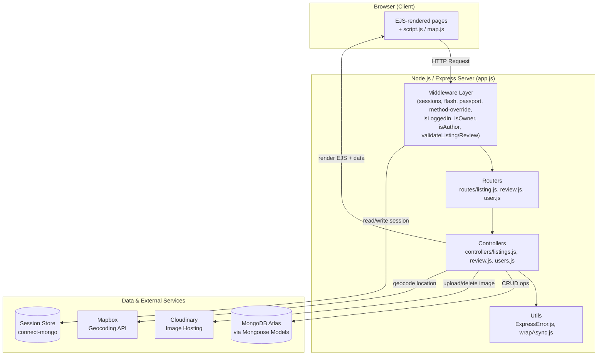
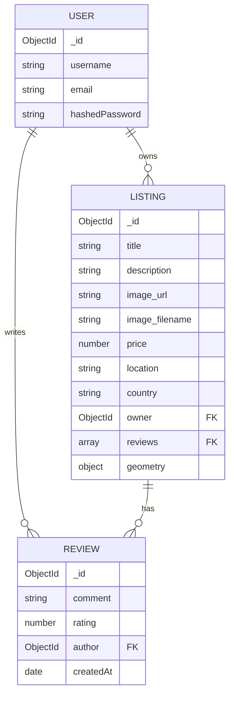
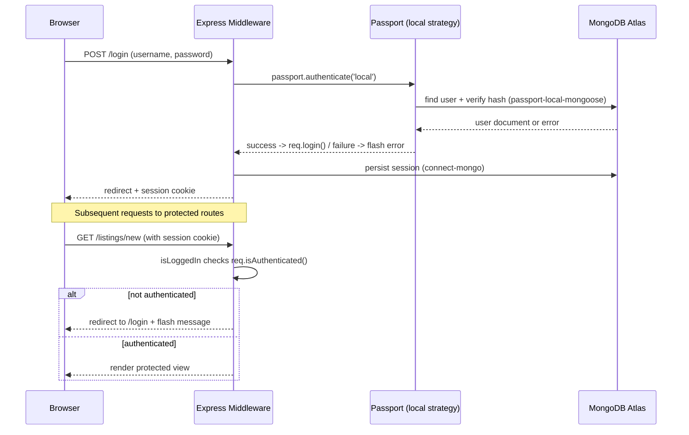
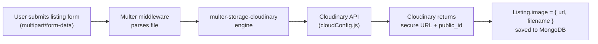

# 🏡 WanderLust — Airbnb-Style Property Listing & Rental Platform

<p align="center">
  
  
  
  
  
  
  
</p>

<p align="center">
  <b>A full-stack property listing and rental platform built with Node.js, Express.js, MongoDB, and EJS.</b>
  <br/>
  Users can explore properties, create listings, upload images, view locations on interactive maps, and interact with reviews through a secure authentication system.
</p>

<p align="center">
  <a href="#-live-demo">Live Demo</a> •
  <a href="#-features">Features</a> •
  <a href="#-tech-stack">Tech Stack</a> •
  <a href="#-installation">Installation</a> •
  <a href="#-routes">Routes</a> •
  <a href="#-deployment">Deployment</a> •
  <a href="#-interview-questions">Interview Prep</a>
</p>

---

## 📖 Table of Contents

- [About the Project](#-about-the-project)
- [Live Demo](#-live-demo)
- [Features](#-features)
- [Application Preview](#-application-preview)
- [Tech Stack](#-tech-stack)
- [System Design & Architecture](#-system-design--architecture)
- [Folder Structure](#-folder-structure)
- [Prerequisites](#-prerequisites)
- [Installation](#-installation)
- [Available Scripts](#-available-scripts)
- [Environment Variables](#-environment-variables)
- [Routes](#-routes)
- [Data Models](#-data-models)
- [Authentication Flow](#-authentication-flow)
- [Image Uploads](#-image-uploads-cloudinary)
- [Maps & Geocoding](#-maps--geocoding-mapbox)
- [Error Handling & Validation](#-error-handling--validation)
- [Security Considerations](#-security-considerations)
- [Browser & Device Support](#-browser--device-support)
- [Deployment](#-deployment)
- [Common Issues & Fixes](#-common-issues--fixes)
- [Interview Questions](#-interview-questions)
- [Future Scope](#-future-scope)
- [Contributing](#-contributing)
- [Author](#-author)
- [License](#-license)

---

## 🌍 About the Project

**WanderLust** is a full-stack property listing and rental web application inspired by the core experience of Airbnb. It follows the **MVC (Model-View-Controller)** architecture and demonstrates a complete backend workflow including database modeling, authentication, image uploads, geolocation, validation, and cloud deployment.

The project was built as a hands-on learning project in backend web development using **Node.js, Express.js, MongoDB, and EJS**.

---

## 🚀 Live Demo

🔗 **Live Application:**
https://wanderlust-1-lzc6.onrender.com/listings

📦 **GitHub Repository:**
https://github.com/shambhavi0608/Wanderlust

> The application is deployed on Render and uses MongoDB Atlas as the cloud database.

---

## ✨ Features

- 🏠 **Property Listing CRUD** — Create, read, update, and delete listings
- 🔐 **User Authentication** — Signup, login, and logout using Passport.js
- 🛡️ **Authorization** — Only authenticated users can create listings
- 👤 **Owner Authorization** — Only listing owners can edit or delete their listings
- 📝 **Review System** — Logged-in users can add and delete reviews with star ratings
- 🖼️ **Image Uploads** — Images are uploaded and hosted using Cloudinary
- 🗺️ **Interactive Maps** — Listing locations are displayed using Mapbox
- 💬 **Flash Messages** — Success and error feedback using connect-flash
- ✅ **Server-side Validation** — Joi validation for listings and reviews
- 🍪 **Persistent Sessions** — Sessions are stored in MongoDB using connect-mongo
- 🚦 **Centralized Error Handling** — Custom ExpressError class and wrapAsync utility
- 📱 **Responsive UI** — EJS templates with custom CSS
- 🔍 **Search & Filter** — Browse listings based on available categories
- ☁️ **Cloud Deployment** — Application deployed using Render with MongoDB Atlas

---

## 🌐 Application Preview

WanderLust provides an Airbnb-inspired rental experience where users can:

- Browse available properties
- Filter listings by categories
- View detailed property information
- Create and manage their own listings
- Upload listing images through Cloudinary
- View property locations using Mapbox
- Register and authenticate securely
- Add and manage reviews
- Receive feedback through flash messages

🔗 **Try the live application:**
https://wanderlust-1-lzc6.onrender.com/listings

### 📸 Screenshots

> Add screenshots or a short GIF walkthrough here to make the README more recruiter-friendly, e.g.:
>
> ```md
> 
> 
> 
> ```
>
> Save the actual screenshots into a `public/screenshots/` folder and update the paths above.

---

## 🛠️ Tech Stack

| Layer | Technology |
|---|---|
| **Runtime** | Node.js |
| **Framework** | Express.js |
| **Database** | MongoDB Atlas |
| **ODM** | Mongoose |
| **Templating Engine** | EJS + EJS-Mate |
| **Authentication** | Passport.js + passport-local-mongoose |
| **Session Store** | express-session + connect-mongo |
| **Validation** | Joi |
| **File Uploads** | Multer |
| **Image Hosting** | Cloudinary |
| **Maps & Geocoding** | Mapbox SDK |
| **Flash Messages** | connect-flash |
| **Development Tools** | Nodemon, dotenv |
| **Deployment** | Render |
| **Version Control** | Git & GitHub |

---

## 🏗️ System Design & Architecture

### High-Level Architecture

WanderLust follows a classic **server-rendered MVC (Model–View–Controller)** architecture on top of a **monolithic Node.js/Express backend**. There is no separate frontend SPA — Express renders EJS templates on the server and sends fully-formed HTML to the browser, with a small amount of client-side JS (`map.js`, `script.js`) for interactivity (Mapbox rendering, form validation, etc.).



### Request Lifecycle

1. **Client request** hits `app.js`, which boots Express and mounts global middleware (body parsing, `method-override`, static files, `express-session` + `connect-mongo`, `connect-flash`, Passport initialization).
2. The request is matched against one of the three **routers** (`routes/listing.js`, `routes/review.js`, `routes/user.js`).
3. Route-level middleware runs first — `isLoggedIn` (authentication gate), `isOwner` / `isAuthor` (authorization gate), and `validateListing` / `validateReview` (Joi schema validation from `schema.js`).
4. The matching **controller function** (in `controllers/`) executes the actual business logic — querying Mongoose models, talking to Cloudinary/Mapbox, and preparing data for the view.
5. Any error thrown (sync or async) is caught by `wrapAsync` and forwarded to Express's centralized error-handling middleware, which uses the custom `ExpressError` class and renders `views/error.ejs`.
6. On success, the controller renders an **EJS view** (via `ejs-mate` for layout support) or redirects with a flash message.
7. The browser receives HTML; `map.js` then calls the Mapbox GL JS API client-side to render the interactive map using the coordinates embedded in the page.

### MVC Layer Responsibilities

| Layer | Folder | Responsibility |
|---|---|---|
| **Model** | `models/` | Mongoose schemas for `Listing`, `Review`, `User`; define shape of data, relationships (`ref`/`populate`), and (for `User`) plug in `passport-local-mongoose`. |
| **View** | `views/` | EJS templates rendered per-route; `includes/` for partials (navbar, footer, flash messages), `layouts/` for the shared boilerplate via `ejs-mate`. |
| **Controller** | `controllers/` | Pure request-handling logic — no routing definitions here; receives `req/res`, talks to models & external APIs, decides what to render/redirect. |
| **Router** | `routes/` | Declares URL paths + HTTP verbs, wires up middleware chains, and delegates to controller functions. |
| **Middleware** | `middlewares.js` | Cross-cutting concerns: `isLoggedIn`, `isOwner`, `isAuthor`, `validateListing`, `validateReview`, and storing `req.originalUrl` for post-login redirects. |
| **Validation Schema** | `schema.js` | Joi schemas used by the validation middleware to reject malformed listing/review payloads before they reach the controller. |
| **Utils** | `utils/` | `ExpressError` (custom error class with status code + message) and `wrapAsync` (wraps async route handlers so rejected promises reach Express's error handler). |
| **Config** | `cloudConfig.js` | Cloudinary SDK + Multer storage engine configuration, exported for use in listing routes/controllers. |
| **Seed Data** | `init/` | `data.js` (sample listings) + `index.js` (script to seed MongoDB, run manually via `node init/index.js`). |

### Data Model / Entity Relationship



- `Listing.owner` references `User` (one owner per listing).
- `Listing.reviews` is an array of `Review` ObjectIds (populated when a listing is fetched).
- `Review.author` references `User`.
- Deleting a `Listing` also cleans up its associated `Review` documents (via a Mongoose post-hook / manual cleanup in the delete controller), preventing orphaned reviews.

### Authentication & Authorization Flow



- **Authentication** (who you are) is handled by Passport's local strategy + `passport-local-mongoose`, which salts/hashes passwords and manages the credential-verification logic.
- **Authorization** (what you're allowed to do) is enforced separately per action: `isOwner` checks `listing.owner.equals(req.user._id)` before allowing edit/delete; `isAuthor` does the equivalent check on `review.author` before allowing review deletion.
- Sessions are **stateful and server-side**, stored in MongoDB via `connect-mongo`, so they survive server restarts (unlike in-memory sessions) and scale across multiple server instances sharing the same database.

### Image Upload Flow



Images are **never stored on the Express server's disk** — Multer streams the upload directly to Cloudinary via `multer-storage-cloudinary`, and only the returned URL/filename is persisted in MongoDB. This keeps the app stateless and safe to redeploy on ephemeral hosts like Render.

### Why These Design Choices

- **Server-rendered EJS over a separate frontend SPA** — simpler deployment (single Render service), no CORS/API-versioning overhead, and matches the scope of a learning project.
- **MongoDB + Mongoose** — flexible schema fits variable listing data (geometry, nested owner/review refs) better than a rigid relational schema for this use case.
- **Session-based auth (not JWT)** — simpler to reason about for a server-rendered app where the browser and server are tightly coupled; `connect-mongo` gives persistence without needing Redis.
- **Centralized error handling (`ExpressError` + `wrapAsync`)** — avoids repetitive try/catch in every controller and guarantees consistent error pages.
- **Cloudinary over local disk storage** — Render's filesystem is ephemeral (wiped on redeploy/restart), so any locally-stored upload would be lost; Cloudinary makes image storage durable and CDN-backed.

---

## 📁 Folder Structure

```text
Wanderlust/
├── controllers/
│   ├── listings.js
│   ├── review.js
│   └── users.js
├── init/
│   ├── data.js
│   └── index.js
├── models/
│   ├── listing.js
│   ├── review.js
│   └── user.js
├── public/
│   ├── css/
│   │   └── style.css
│   └── js/
│       ├── map.js
│       └── script.js
├── routes/
│   ├── listing.js
│   ├── review.js
│   └── user.js
├── utils/
│   ├── ExpressError.js
│   └── wrapAsync.js
├── views/
│   ├── includes/
│   ├── layouts/
│   ├── listings/
│   ├── users/
│   └── error.ejs
├── app.js
├── cloudConfig.js
├── middlewares.js
├── schema.js
├── .gitignore
├── package.json
└── README.md
```

---

## ✅ Prerequisites

Make sure you have the following installed/available before setting up the project:

- **Node.js** v16 or higher (v18+ recommended)
- **npm** (bundled with Node.js)
- A **MongoDB Atlas** account (or a local MongoDB instance) with a connection string
- A **Cloudinary** account (cloud name, API key, API secret)
- A **Mapbox** account with a public access token
- **Git** for cloning the repository

---

## ⚙️ Installation

### 1. Clone the repository

```bash
git clone https://github.com/shambhavi0608/Wanderlust.git
cd Wanderlust
```

### 2. Install dependencies

```bash
npm install
```

### 3. Set up environment variables

Create a `.env` file in the root directory.

```env
ATLASDB_URL=your_mongodb_atlas_connection_string
CLOUD_NAME=your_cloudinary_cloud_name
CLOUD_API_KEY=your_cloudinary_api_key
CLOUD_API_SECRET=your_cloudinary_api_secret
MAP_TOKEN=your_mapbox_access_token
SECRET=your_session_secret_key
```

### 4. Seed the database

Optional — only if you want to add sample data.

```bash
node init/index.js
```

### 5. Run the application

```bash
npm start
```

The application will run at:

```
http://localhost:8080
```

---

## 📜 Available Scripts

| Command | Description |
|---|---|
| `npm start` | Starts the app in production mode (`node app.js`) — used by Render. |
| `npm run dev` | (If configured) Starts the app with `nodemon` for auto-reload during development. |
| `node init/index.js` | Seeds MongoDB with sample listing data from `init/data.js`. |

> If `npm run dev` isn't yet defined in your `package.json`, add it as `"dev": "nodemon app.js"` for a smoother local dev loop.

---

## 🔑 Environment Variables

The following environment variables are required:

```env
ATLASDB_URL=your_mongodb_atlas_connection_string
CLOUD_NAME=your_cloudinary_cloud_name
CLOUD_API_KEY=your_cloudinary_api_key
CLOUD_API_SECRET=your_cloudinary_api_secret
MAP_TOKEN=your_mapbox_access_token
SECRET=your_session_secret_key
```

⚠️ Never commit your `.env` file to GitHub.

Keep `.env` inside `.gitignore` and use environment variables on deployment platforms such as Render.

---

## 🧭 Routes

### Listings

| Method | Route | Description | Authentication |
|---|---|---|---|
| GET | `/listings` | View all listings | No |
| GET | `/listings/new` | Create listing form | Yes |
| POST | `/listings` | Create a listing | Yes |
| GET | `/listings/:id` | View a listing | No |
| GET | `/listings/:id/edit` | Edit listing form | Owner only |
| PUT | `/listings/:id` | Update listing | Owner only |
| DELETE | `/listings/:id` | Delete listing | Owner only |

### Reviews

| Method | Route | Description | Authentication |
|---|---|---|---|
| POST | `/listings/:id/reviews` | Add a review | Yes |
| DELETE | `/listings/:id/reviews/:reviewId` | Delete a review | Author only |

### Users / Authentication

| Method | Route | Description |
|---|---|---|
| GET | `/signup` | Signup form |
| POST | `/signup` | Register user |
| GET | `/login` | Login form |
| POST | `/login` | Authenticate user |
| GET | `/logout` | Logout user |

---

## 🗃️ Data Models

### Listing

A listing contains:

- Title
- Description
- Image
- Price
- Location
- Country
- Owner
- Reviews
- Geometry coordinates

### Review

A review contains:

- Comment
- Rating
- Author
- Created date

### User

A user contains:

- Username
- Email
- Hashed password

### Relationships

- A Listing has many Reviews
- A Listing belongs to one Owner
- A Review belongs to one Author

---

## 🔐 Authentication Flow

1. User signs up.
2. Password is salted and hashed using passport-local-mongoose.
3. Passport's local strategy authenticates login credentials.
4. A session is created and stored in MongoDB using connect-mongo.
5. Authorization middleware protects restricted routes.
6. On logout, the session is destroyed.

---

## 🖼️ Image Uploads (Cloudinary)

- Cloudinary is configured through `cloudConfig.js`.
- Multer handles incoming file uploads.
- multer-storage-cloudinary sends images directly to Cloudinary.
- Listing documents store the Cloudinary image URL and filename.

---

## 🗺️ Maps & Geocoding (Mapbox)

- Listing locations are converted into latitude and longitude using Mapbox Geocoding.
- The coordinates are stored with the listing.
- `map.js` displays the location using an interactive Mapbox map.

---

## 🚨 Error Handling & Validation

- Joi validates listing and review data.
- ExpressError provides custom application errors.
- wrapAsync forwards asynchronous errors to Express error middleware.
- A dedicated `error.ejs` page displays user-friendly error messages.

---

## 🔒 Security Considerations

- **Password storage**: passwords are never stored in plain text — `passport-local-mongoose` salts and hashes them before saving.
- **Secrets management**: all credentials (DB URL, Cloudinary keys, Mapbox token, session secret) live in `.env`, which is excluded from version control via `.gitignore`.
- **Session security**: sessions are signed with `SECRET` and stored server-side in MongoDB rather than trusting client-side cookies with sensitive data.
- **Authorization checks**: ownership/authorship is re-verified on every edit/delete request (`isOwner`, `isAuthor`), not just hidden in the UI — so a user can't bypass restrictions by calling the route directly.
- **Input validation**: all incoming listing/review data is validated server-side with Joi (`schema.js`) before it touches the database, guarding against malformed or malicious payloads.
- **Recommended hardening (not yet implemented)**: rate limiting on auth routes, `helmet` for secure HTTP headers, CSRF protection on forms, and input sanitization against NoSQL injection (`express-mongo-sanitize`). Worth listing under Future Scope if not already handled in code.

---

## 🌐 Browser & Device Support

- Works on modern evergreen browsers (Chrome, Firefox, Edge, Safari).
- Responsive layout via custom CSS — usable on both desktop and mobile viewports.
- Interactive Mapbox map requires JavaScript enabled and a working network connection to load map tiles.

---

## ☁️ Deployment

The application is deployed using Render, with MongoDB Atlas as the database.

### Deployment Steps

1. Push the latest code to GitHub.
2. Connect the GitHub repository to Render.
3. Set the Build Command: `npm install`
4. Set the Start Command: `npm start`
5. Add the required environment variables in Render.
6. Configure MongoDB Atlas Network Access.
7. Deploy the application.
8. Render provides the live `.onrender.com` URL.

### Live Deployment

https://wanderlust-1-lzc6.onrender.com/listings

---

## 🩹 Common Issues & Fixes

| Issue | Possible Cause | Fix |
|---|---|---|
| Missing script: start | Start script missing in package.json | Add `"start": "node app.js"` |
| MongoServerSelectionError | MongoDB Atlas access issue | Check Atlas Network Access and connection string |
| Sessions not persisting | Proxy/session configuration | Check production session configuration |
| Images not uploading | Cloudinary configuration issue | Check Cloudinary environment variables |
| Map not showing | Invalid Mapbox token | Check or regenerate Mapbox token |

---

## 💡 Interview Questions

### Node.js & Express

- What is middleware in Express?
- What is the difference between GET, POST, PUT, and DELETE?
- Why is method-override used?
- What does wrapAsync do?
- Explain MVC architecture.

### MongoDB & Mongoose

- What is the difference between MongoDB and Mongoose?
- How are relationships represented in MongoDB?
- What is populate() in Mongoose?
- What is connect-mongo used for?

### Authentication & Security

- What is authentication vs authorization?
- How does passport-local-mongoose handle passwords?
- Why should secrets be stored in environment variables?
- What should you do if an API key is accidentally pushed to GitHub?

### REST & HTTP

- What makes an API RESTful?
- What is the difference between PUT and PATCH?

### Deployment

- Why is MongoDB Atlas Network Access required?
- What is `.gitignore` used for?
- How are environment variables handled differently locally and on Render?

### Frontend

- Why use EJS-Mate?
- What are flash messages and why are they useful?

---

## 🔮 Future Scope

- 💳 Payment gateway integration
- ⭐ Advanced filtering by price, amenities, and categories
- 📧 Email notifications for bookings
- 📊 Admin dashboard
- 🌓 Dark mode
- 🧪 Unit and integration testing

---

## 🤝 Contributing

Contributions are welcome.

1. Fork the repository.
2. Create a new branch:
   ```bash
   git checkout -b feature/your-feature-name
   ```
3. Commit your changes:
   ```bash
   git commit -m "Add: your feature"
   ```
4. Push the branch:
   ```bash
   git push origin feature/your-feature-name
   ```
5. Open a Pull Request.

---

## 👩‍💻 Author

**Shambhavi**

🔗 GitHub: https://github.com/shambhavi0608

---

## 📄 License

This project is open-sourced for learning purposes. Feel free to explore, learn from, and build upon it.

> **Note:** No formal OSI license (e.g. MIT) is currently attached to this repository. If you want others to be able to reuse the code with clear legal permission, add a `LICENSE` file — MIT is the most common choice for learning/portfolio projects like this one.

<p align="center">
  ⭐ If you found this project helpful, consider giving it a star on GitHub!
</p>
